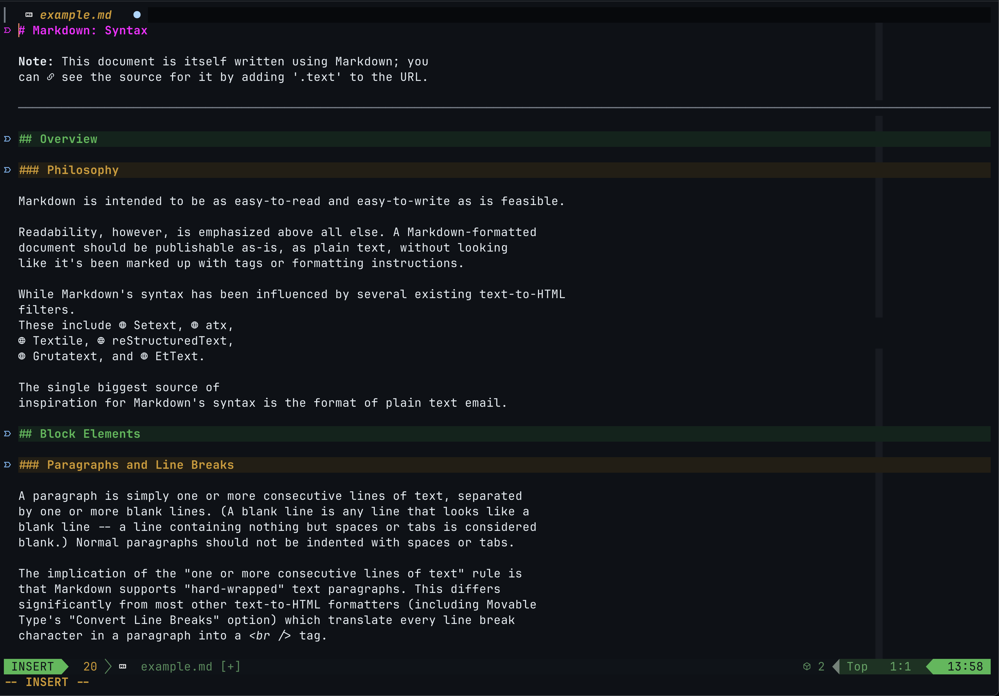

# Neovim Configuration

A minimal Neovim setup built around a comprehensive Markdown editing experience.
Includes a full agentic harness for using with Claude Code.



## Quick Install

```sh
curl -sSL https://raw.githubusercontent.com/nikoheikkila/nvim/refs/heads/main/scripts/install.sh | sh
```

The script installs the latest [release](https://github.com/nikoheikkila/nvim/releases) into
`$XDG_CONFIG_HOME/nvim` (or `~/.config/nvim`), backing up any existing configuration first. See
[Installation](docs/installation.md) for requirements, flags, and manual installation from source.

## Documentation

- [Installation](docs/installation.md) — requirements, quick install, manual install, optional tools
- [Plugins](docs/plugins.md) — the plugin set and how to update it safely
- [Editing](docs/editing.md) — general shortcuts, buffer tabs, multiple cursors
- [Code Intelligence (LSP)](docs/lsp.md) — language servers, completion, diagnostics, refactoring
- [Markdown Features](docs/markdown.md) — Markdown shortcuts, formatting, linting, rendering, daily notes
- [File Explorer](docs/explorer.md) — the file-tree sidebar

Want to contribute? See the [contributing guide](CONTRIBUTING.md) for the development environment, test
suites, coding style, and pull-request workflow.
