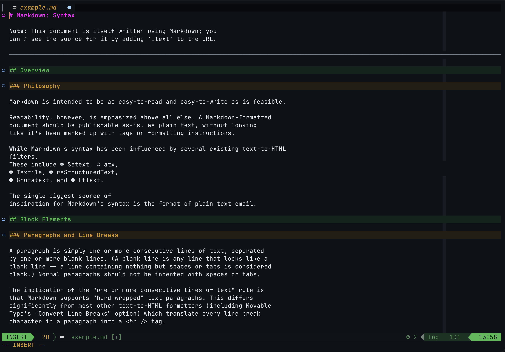

# Neovim Configuration

A minimal Neovim setup built around a comprehensive Markdown editing experience.
Includes a full agentic harness for using with Claude Code.



## What You Get

- **Three layers of prose checking, colour-coded so you can tell them apart.** Harper underlines spelling and
  grammar in dark red, Vale underlines style — wordiness, weasel words, clichés — in violet, and markdownlint
  bands structural problems in dark yellow. All three update as you type, without saving, and
  <kbd>Space c a</kbd> offers fixes from whichever flagged the word under the cursor.
- **Markdown as a first-class language**, not a fallback: live rendering, folding, list and table editing,
  format on save via prettier.
- **An Obsidian vault that behaves like one** — wiki-links, backlinks, daily notes, pasted image attachments.
- **Language servers for code**, installed automatically by `mason.nvim` the first time you open a file.
- **Configuration in YAML, not Lua.** `theme.yml` and `config.yml` cover the colour scheme, the vault, and
  every prose-checker option; `.vale.ini` picks the writing-style rules. No Lua required to make it yours.

## Quick Install

```sh
curl -sSL https://raw.githubusercontent.com/nikoheikkila/nvim/refs/heads/main/scripts/install.sh | sh
```

The script installs the latest [release](https://github.com/nikoheikkila/nvim/releases) into
`$XDG_CONFIG_HOME/nvim` (or `~/.config/nvim`), backing up any existing configuration first. See
[Installation](docs/installation.md) for requirements, flags, and manual installation from source.

## Documentation

- [Installation](docs/installation.md) — requirements, quick install, manual install, optional tools
- [Plugins](docs/plugins.md) — the plugin set and how to update it safely
- [Theming](docs/theming.md) — pick and configure the color scheme via `theme.yml`
- [Editing](docs/editing.md) — general shortcuts, buffer tabs, multiple cursors
- [Code Intelligence (LSP)](docs/lsp.md) — language servers, completion, diagnostics, refactoring, prose checking
- [Markdown Features](docs/markdown.md) — Markdown shortcuts, formatting, linting, rendering, daily notes
- [Obsidian Vault](docs/obsidian.md) — wiki-links, backlinks, daily notes, image attachments
- [File Explorer](docs/explorer.md) — the file-tree sidebar
- [Terminal Setup](docs/terminal.md) — enabling wavy underline support in the terminal

Want to contribute? See the [contributing guide](CONTRIBUTING.md) for the development environment, test
suites, coding style, and pull-request workflow.
